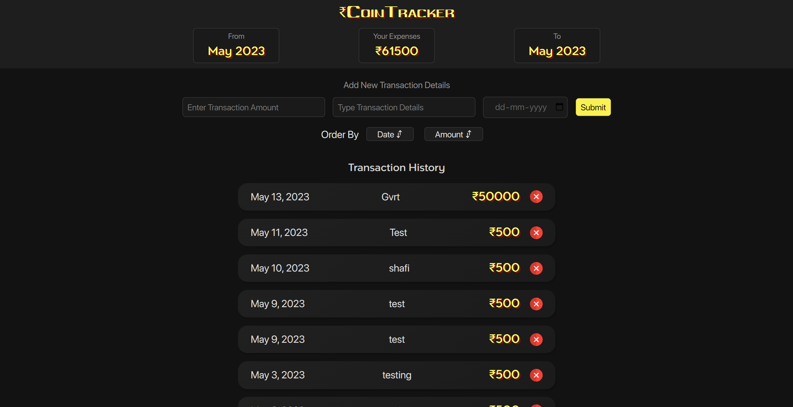

# Coin Tracker

Website link: [Coin Tracker](https://tubular-starship-f4c8df.netlify.app/)

## Project Description

Coin Tracker is a comprehensive web application built using the MERN (MongoDB, Express.js, React, Node.js) stack. It provides users with a powerful and user-friendly platform to track and monitor expemses and set budgets.

## Skills Used
The development of Coin Tracker involved utilizing the following technologies and frameworks:
- Frontend: React, JavaScript, HTML, CSS
- Backend: Node.js, Express.js
- Database: MongoDB
- Deployment: Netlify (Frontend), Render (Backend)

## GitHub Repository
The source code for Coin Tracker is available on GitHub: [Coin Tracker GitHub Repository](https://github.com/shafi099/MoneyTracker)

Please note that Coin Tracker is an ongoing project, and additional features and improvements may be added in the future.

